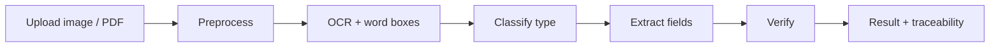

# MOSIP-OCR-Suite

**A document information-extraction and verification service for identity documents.**

OCR is the input layer — the engineering is what happens after the text comes out: **layout-aware field extraction**, **multi-signal verification** (checksums, format rules, and machine-readable-zone validation), and **field-to-pixel traceability**, so every extracted value can be traced back to exactly where it came from on the page.

A full-stack rebuild of a hackathon prototype: a FastAPI backend and a React frontend, containerized and runnable with a single command.

> The original hackathon submission is preserved at [MOSIP-OCR-Suite-hackathon-archive](https://github.com/coDEmaVEriCK06/MOSIP-OCR-Suite-hackathon-archive).

## What it does

Upload an image or PDF of an identity document (Aadhaar, PAN, or passport), and the service:

1. **Preprocesses** the image (grayscale, denoise, adaptive threshold) to improve recognition — coordinate-preserving, so bounding boxes still align with the original.
2. **Extracts text** with Tesseract, capturing every word with its confidence and bounding box.
3. **Classifies** the document type from keyword and format signals, with a confidence score.
4. **Extracts fields** with a hybrid strategy: spatial/layout analysis for label–value pairs (name, father's name) and pattern matching for structured fields (dates, ID numbers). Every field carries the source word-boxes it was built from.
5. **Verifies** what it found:
   - **Verhoeff checksum** on Aadhaar numbers
   - **Format validation** for PAN and passport numbers
   - **Date-of-birth** sanity checks
   - **MRZ (machine-readable zone)** parsing for passports, with **ICAO check-digit validation** and a cross-check that the MRZ date of birth matches the printed one
6. **Displays** the result: the document with confidence-coloured boxes, a page-by-page PDF viewer, and an analysis panel where hovering a field highlights exactly where on the document it came from. Results export as JSON.

## The pipeline



## Why this is interesting (the engineering, not the OCR)

OCR is a commodity; the contribution is the layer on top.

- **Layout-aware extraction.** Rather than regexing a flat text blob, the extractor reconstructs lines from word geometry and locates values by their spatial relationship to labels. This avoids brittle failures like a surname elsewhere on the card colliding with a "Name" label.
- **Verification as an engine-agnostic safety net.** Check digits (Verhoeff, ICAO) validate the *content*, not the OCR. A transposed digit — whether a misread or a tampered document — fails the checksum, so the same mechanism catches recognition errors and tampering.
- **Field-to-pixel traceability.** Every field knows which pixels it came from, so the UI can show provenance. That is the difference between "here is some text" and "here is a value you can audit."
- **Privacy by design.** Recognition runs locally with Tesseract — identity documents never leave the machine for a cloud OCR API.

## Architecture

**Backend** (FastAPI):
- `preprocessing/` — OpenCV pipeline
- `services/ocr.py` — async-safe Tesseract + PDF rasterization, with a SHA-256 result cache
- `extraction/` — document classification, layout analysis, field extraction
- `verification/` — Verhoeff, format rules, MRZ parsing + ICAO check digits
- `routers/`, `models/`, `config.py`, `main.py` — API, schemas, settings, app wiring

**Frontend** (React + Vite):
- a document canvas with the bounding-box overlay and multi-page PDF viewer
- an analysis rail with the verification verdict, fields, and field↔box cross-highlight

Both are containerized; nginx serves the built frontend and proxies `/api` to the backend.

## Tech stack

- **Backend:** Python 3.12, FastAPI, Pydantic, Tesseract (pytesseract), Poppler (pdf2image), OpenCV, NumPy
- **Frontend:** React, Vite
- **Infrastructure:** Docker, Docker Compose, nginx
- **Testing:** pytest (60 tests)

## Getting started

### With Docker (recommended)

```bash
docker compose up --build
```

Then open http://localhost:5173.

### Local development

Backend (requires system packages `tesseract-ocr` and `poppler-utils`):

```bash
cd backend
python -m venv .venv && source .venv/bin/activate
pip install -r requirements.txt
python -m uvicorn app.main:app --reload
```

Frontend:

```bash
cd frontend
npm install
npm run dev
```

## API

- `POST /api/extract` — multipart upload (image or PDF). Returns extracted text, per-word boxes, document analysis, verification results, and page previews.
- `GET /api/health` — health check.
- Interactive API docs at `/docs` (FastAPI / OpenAPI).

## Testing

```bash
cd backend && source .venv/bin/activate
python -m pytest
```

## Scope & future directions

Deliberately scoped to **extraction and verification of three identity-document types** (Aadhaar, PAN, passport). Intentionally left out, with what I would add next:

- **More document types** (driving licence, voter ID) — the framework generalizes; adding a type is mostly new patterns and tests, not new engineering.
- **A dedicated MRZ reader** — production systems route the MRZ strip to a font-specific OCR-B reader; here Tesseract reads the whole page and the check digits catch its errors.
- **Persistence & audit history** — the service is stateless; a datastore would make it a system of record.
- **Robust deskew** — available but off by default, because re-mapping boxes through a rotation needs care to keep traceability exact.

## License

[MIT](LICENSE)
